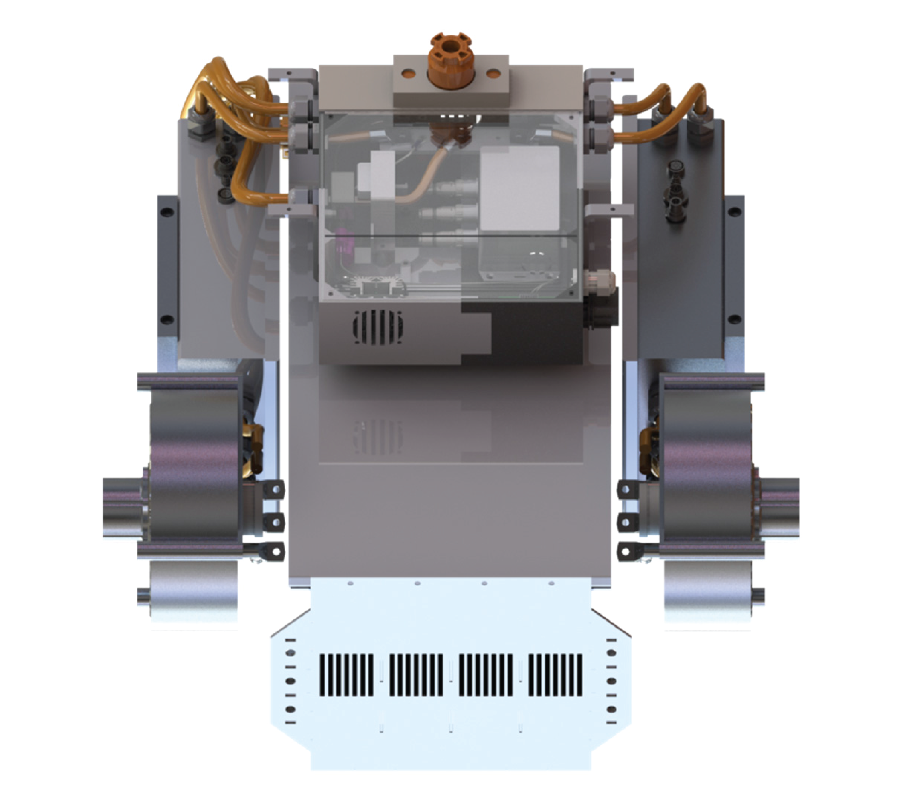
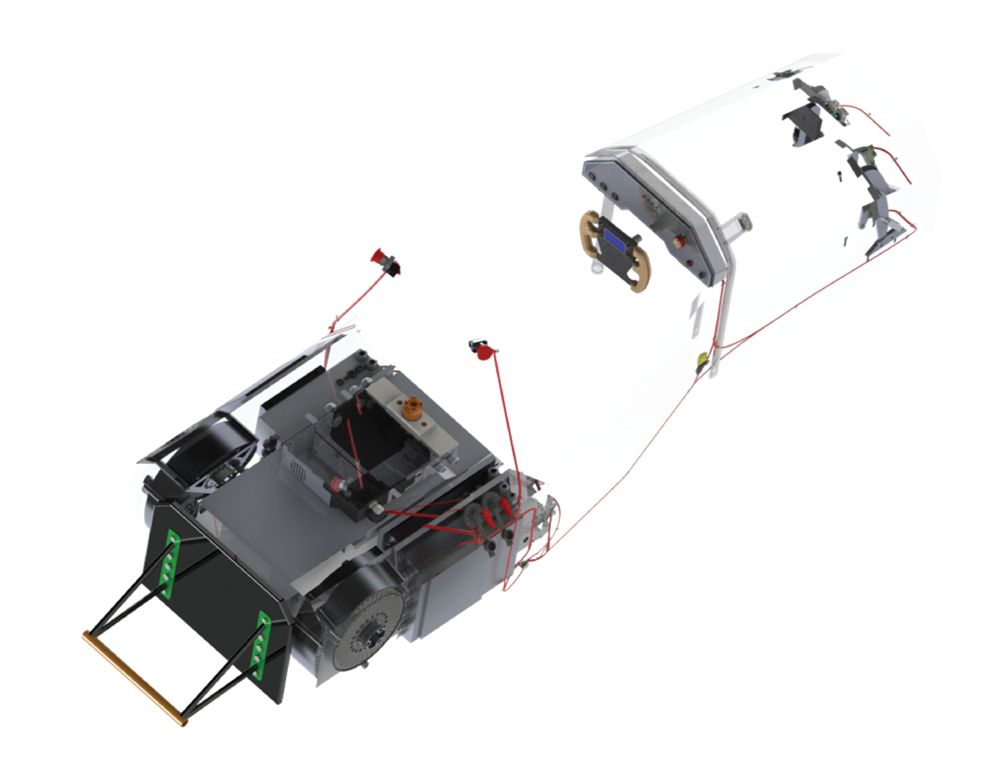
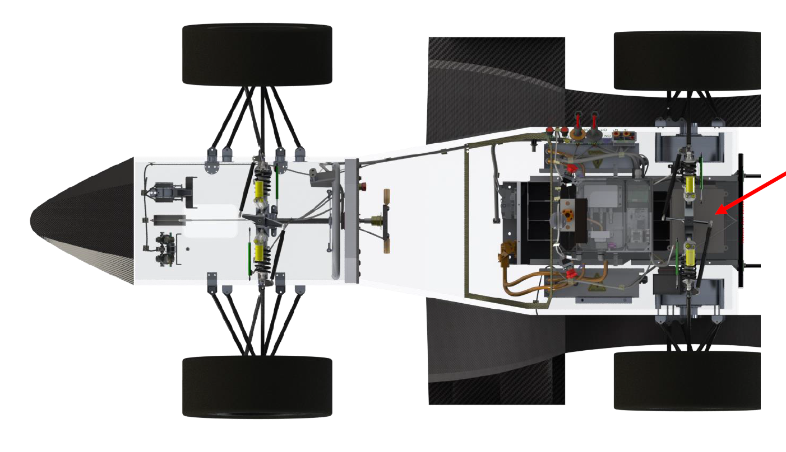

# Electric Powertrain Control & Assembly

Two permanent magnet synchronous motors (ENSTROJ EMRAX 228) using 2 motor controllers (Unitek Bamocar d3) are installed in the formula student race car. The motors are controlled using the motor controller firmware and the assembly of the electric powertrain is presented below.

  

The assembly of the electric powertrain inside the race car is shown below.

